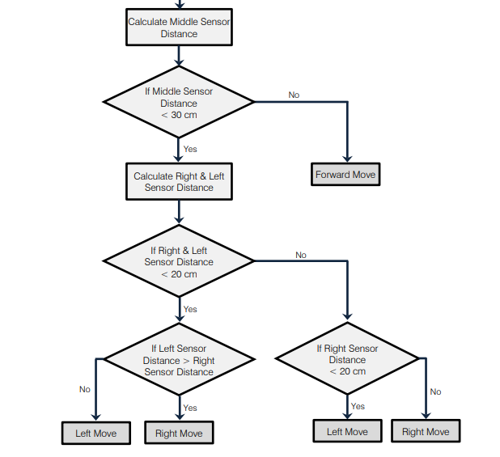
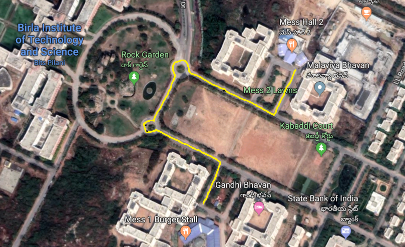

# Autonomous Vehicles

A Convolutional Neural Network approach towards Self-Driving Cars

## CNN model testing simulation

## Prototype setup

## Obstacle avoidance flowchart

## Prototype testing on BITS-Pilani campus roads

## Publication
Paper: https://ieeexplore.ieee.org/document/9030307

Authors: Akhil Agnihotri, Prathamesh Saraf, Kriti Bapnad
